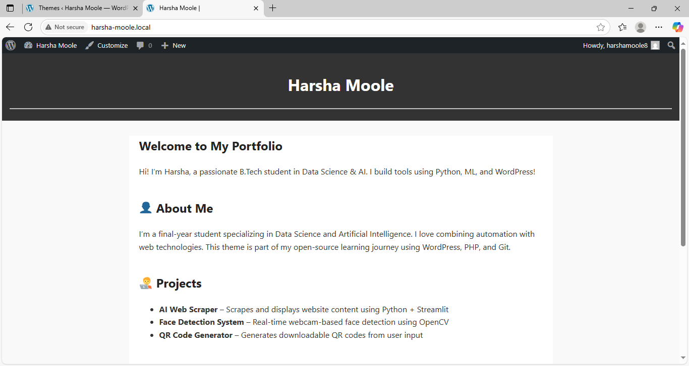

# HarshaMoole Portfolio Theme

A lightweight, responsive WordPress portfolio theme designed to showcase personal projects and skills with clean design and easy customization.

## Features

- Fully responsive layout for all devices  
- Customizable header and footer sections  
- Clean, minimal design focused on your portfolio content  
- Supports standard WordPress theme functionalities  
- Easy to extend and customize with WordPress hooks and templates  

## Installation

1. Clone or download this repository  
2. Copy the theme folder to your WordPress `wp-content/themes` directory  
3. Activate the theme via the WordPress admin dashboard under **Appearance > Themes**  
4. Customize as needed through WordPress customizer or by editing theme files

## Usage

Add your portfolio projects, blog posts, and other content via the WordPress admin. The theme supports all standard post formats.

## Screenshots

## Contributing

Contributions are welcome! Feel free to open issues or pull requests.

## License

This project is licensed under the MIT License - see the [LICENSE](LICENSE) file for details.

---

Created by Harsha Moole  
[https://github.com/harshamoole](https://github.com/harshamoole)
